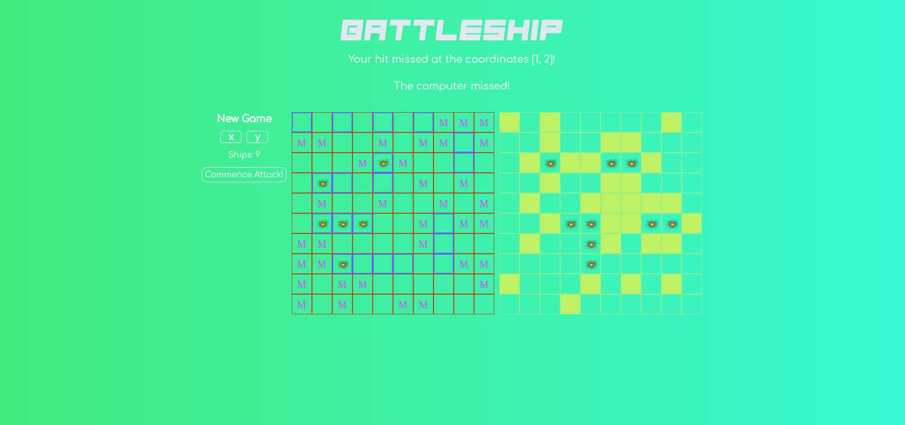

# Battleship Project

## Introduction 
Battleship is a strategy type guessing game for two players. It is played on ruled grids (paper or board) on which
each player's fleet of warships are marked. The locations of the fleets are concealed from the other player. Players
alternate turns calling "shots" at the other player's ships, and the objective of the game is to destroy the opposing
player's fleet.

## Assignment
This project requires the user to develop the application while using Test Driven Development (TDD). The user shouldn't be testing the DOM
for this assignment. The application logic should also be isolated from the DOM manipulation. 

## Review
The application behaves just like a battleship game should. There is no two player mode, but the player is able to play against
the computer. The player is allowed to place 10 ships on their gameboard before the game starts. The 'New Game' button 
will start the game and allow the computer to place ships on their gameboard. The player can change the ship placement axis to the
x-axis or y-axis by pressing the 'X' or 'Y' button. The player and computer gameboard events will be displayed above the gameboard during
gameboard interaction between the player and computer. The application is only available for PC. 

## Live Demo
[Battleship Project](https://ibn12.github.io/odin-battleship/) 